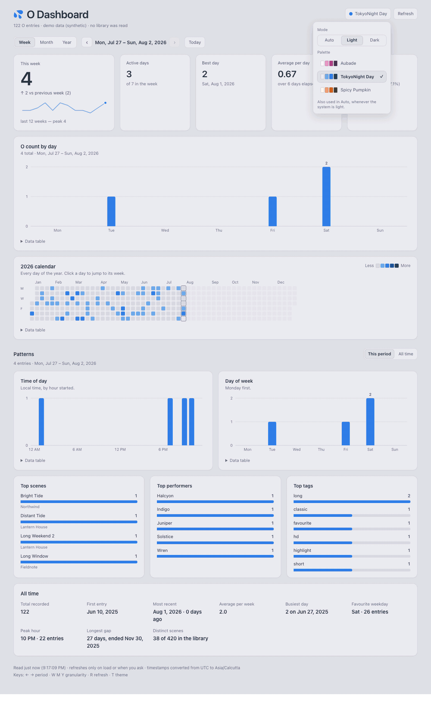
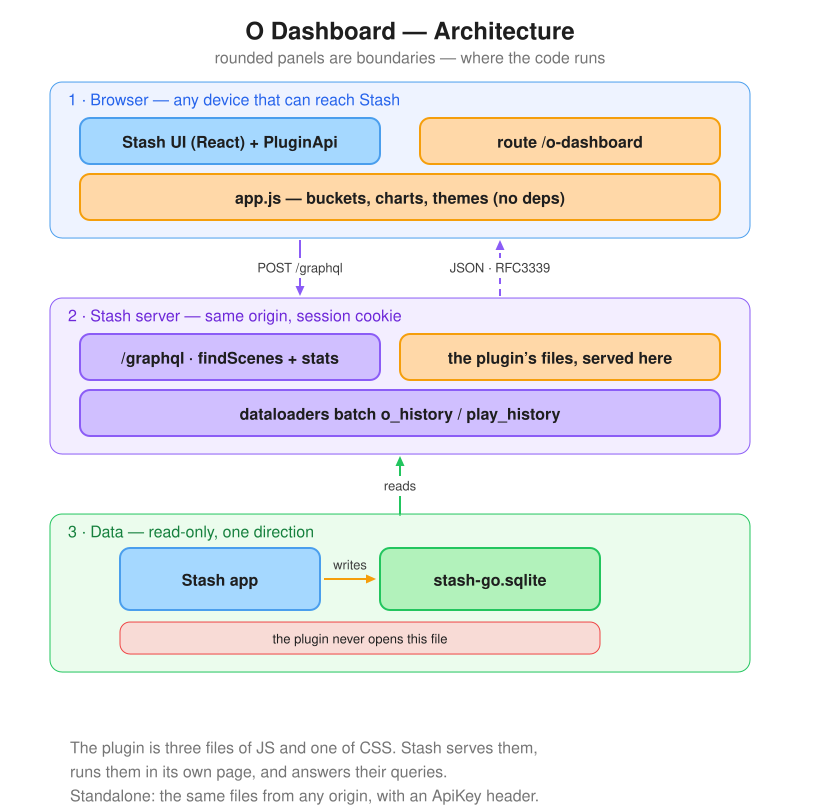
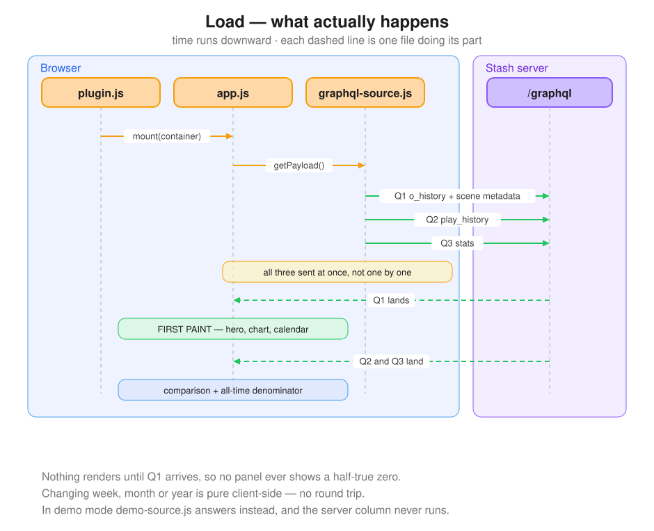
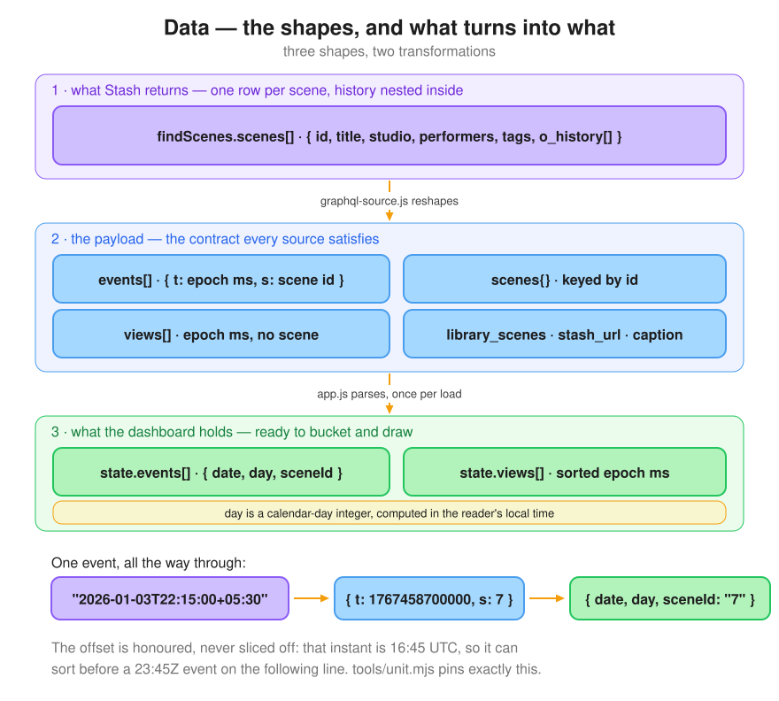
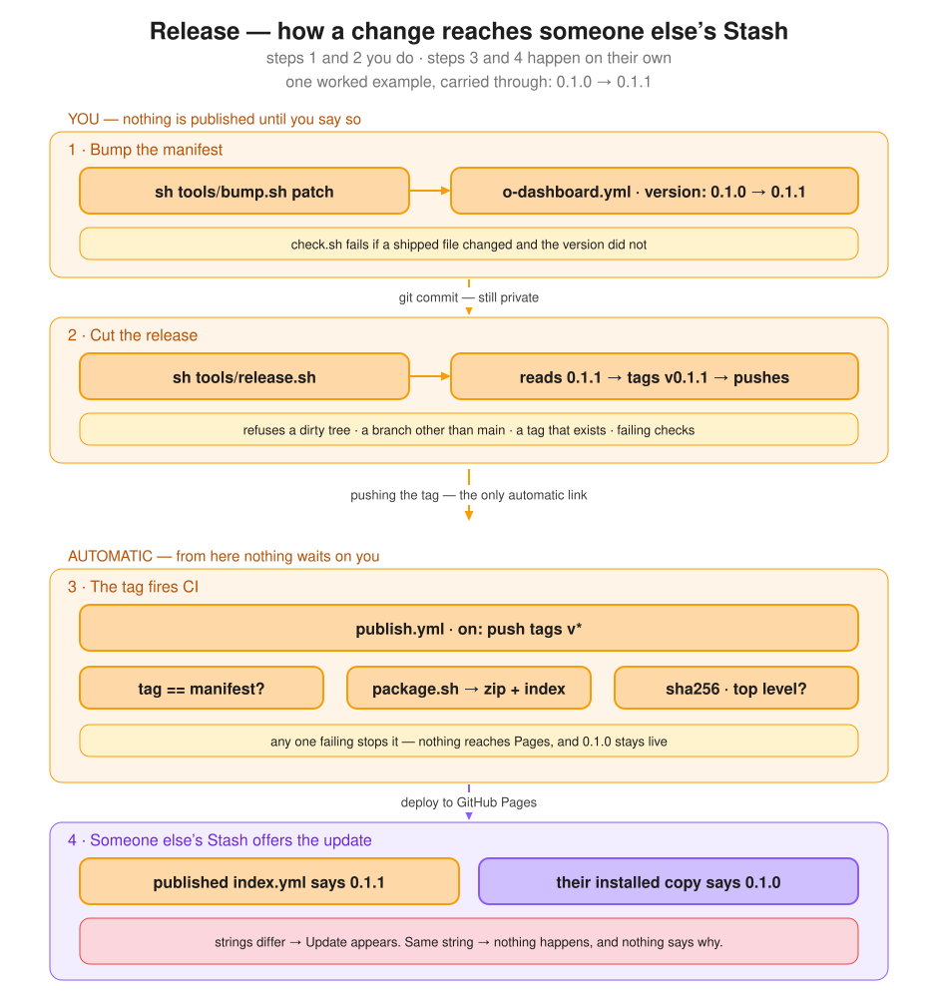
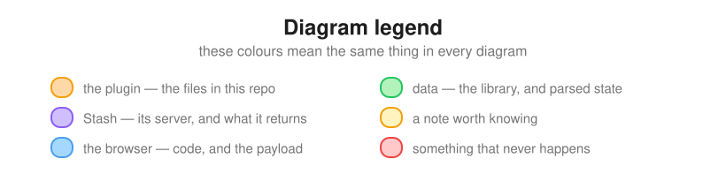

# O Dashboard — a Stash plugin

A dashboard over your Stash O-count history: daily counts, a year calendar,
time-of-day and day-of-week patterns, and ranked scenes, performers and tags.

It reads through **Stash's own GraphQL API**. No database access, no second
server, no credential to manage, and no write path back to Stash.



*The whole dashboard on synthetic demo data, cycling the five palettes with the
theme switcher open.*

## How it works



The rounded panels are boundaries: what runs in the browser, what runs on the
Stash server, and the data underneath, which the plugin never opens.



The two panels are the boundary that matters: everything left of the gap runs
in your browser, and only the three arrows to `/graphql` cross it.
`plugin.js` mounts, `app.js` renders, `graphql-source.js` fetches — and the
first paint happens as soon as Q1 returns, without waiting for the other two.



The data takes three shapes, and only two things change it. Stash returns one
row per scene with its history nested inside; `graphql-source.js` flattens that
into the payload; `app.js` parses the payload once per load into the form the
charts bucket. The worked example is the case worth knowing: timestamps carry
an explicit offset and it is honoured rather than sliced off, so an event at
22:15+05:30 sorts before one at 23:45Z.



Getting a change into someone else's Stash takes four steps: you bump the
version and cut the release, then CI publishes and Stash offers the update. It
is the one path with no feedback when you get it wrong — Stash decides an update
exists by comparing version *strings*, not contents, so shipping a fix without
bumping reaches nobody and says nothing. Hence a guard on your machine and
another in CI, and only a `v*` tag publishes. See [Releasing](#releasing).



## Install

**From a plugin source** — nothing to unzip:

1. Settings → Plugins → **Available Plugins** → **Add Source**
2. Fill in:

   | Field | Value |
   |---|---|
   | Name | `Spicy Pumpkin` — this names the *source*, not the plugin |
   | URL | `https://crazy-spicy-pumpkin.github.io/o-dash-stash-plugin/index.yml` |
   | Local Path | `o-dashboard` — the folder under `plugins/` this source installs into |

3. Expand the new source, tick **O Dashboard**, and click **Install**

It then appears under **Installed Plugins**, where **Check for updates** and
**Update** will pick up new releases.

**By hand** (only if you would rather not add a source): build the zip with
`sh tools/package.sh` and unzip it into a
`plugins/o-dashboard/` directory inside your Stash config — the archive holds the
manifest and `src/` at its top level, with no wrapping folder. Then Settings →
Plugins → Reload plugins.

Do not do both. A hand-copy and a package install can end up side by side with
the same plugin id, and Stash will load one of them unpredictably.

Either way the dashboard appears in the nav bar and at `/o-dashboard`.

## Running it standalone

The same page runs outside Stash, still through GraphQL and still with no
database of its own:

    open src/index.html?stash=http://your-stash:9999

If your Stash requires a password, add an API key (Settings → Security →
Authentication):

    open src/index.html?stash=http://your-stash:9999&key=YOUR_KEY

Both are stored after the first load, so the URL can be trimmed afterwards.
Inside the plugin neither is needed — it is same-origin and rides your existing
session.

> **On API keys.** A key grants full access to Stash. In `localStorage` it is
> readable by anything on that origin, and in a URL it lands in browser history.
> Reasonable for a personal tool on your own machine; the plugin needs no key at
> all, which is always the better option.

## Demo mode

    open src/index.html?demo=1

Synthetic, deterministic, and it touches nothing — no network, no database, no
filesystem. It is how the image above was made: no real library appears anywhere
in this repo.

## Themes

Three modes: **Auto**, the default, follows your operating system; **Light** and
**Dark** pin it. Each mode carries its own set of palettes, and the two choices
are independent — picking a dark palette never disturbs your light one.

| Mode | Palettes | Default |
|---|---|---|
| Light | Aubade · TokyoNight Day · Spicy Pumpkin | TokyoNight Day |
| Dark | Stash · Naughty | Stash |

**Stash** borrows the host UI's own colours so the dashboard doesn't look bolted
on; **Naughty** is the darker standalone palette. `T` cycles the mode.

Every palette carries its own single-hue calendar ramp, generated in OKLCH from
that palette's accent and validated against that palette's own surface —
monotone lightness, minimum step gaps, and contrast computed rather than
eyeballed. The Stash palette sits on a lighter surface than the others, which
caps how far its ramp and text can travel: white on it reaches only 10.7:1, so
its figures are lower than the rest by construction rather than by oversight.

## A tour of the code

About 2,700 lines, no dependencies, no build step. If you want to change
something, this is the order to read it in.

```
o-dashboard.yml        plugin manifest — which files Stash loads, and in what order
src/index.html         the shell: a flat tree of id-addressed cards, filled in by app.js
src/app.js             everything the dashboard does — bucketing, charts, themes
src/graphql-source.js  builds the payload from Stash's API
src/demo-source.js     builds the same payload from synthetic data
src/plugin.js          registers the route and the nav item through PluginApi
src/styles.css         palette roles for all five themes
```

**The seam everything hangs off is one payload object.** Anything that returns
it is a valid data source, and `app.js` never learns which one it got:

```js
{ generated_at, library_scenes, stash_url, source_caption,
  events: [{ t: epochMs, s: sceneId }],
  views:  [epochMs],
  scenes: { "<id>": { title, studio, studio_id, date, rating,
                      performers: [{id, name}], tags: [{id, name}] } } }
```

That is why demo mode is a source and not a flag, and why a third source (a
fixture, a different backend) would need no changes in `app.js`.

Sources publish themselves on `window`, and `app.js` picks the first one
present — demo beats GraphQL — because `app.js` starts loading as it is parsed.
**A source must therefore be loaded before `app.js`**, which is what the order
in the manifest is doing.

`app.js` is one IIFE. Inside: `state` at the top, date helpers, chart renderers
built with `svgEl`, `load()` and `applyPayload()` in the middle, theme handling
and `mountDashboard()` at the end. Rendering is gated on the events having
arrived, so no panel can show a half-true zero while later queries are still in
flight.

### Two invariants that are easy to break

The dashboard is injected into a page it does not own, so:

1. **Every class, id and keyframe name is prefixed `od-`, and every CSS rule is
   scoped under `.od-viz-root`.** Stash is Bootstrap-based and has its own
   `.card`, `.btn`, `.tooltip` and `.spinner`; `$` is `getElementById`, which
   searches the whole document. `tools/leak-check.sh` fails if a rule escapes.
2. **SVG marks get their class through `svgEl({ class: 'od-bar' })`**, not a
   `class=` attribute. A class the stylesheet no longer matches renders a
   perfectly valid, entirely unstyled chart and produces an *identical* DOM —
   `tools/style-check.html` exists because nothing else catches that.

Run `sh tools/check.sh` before opening a PR; it covers both, plus the unit
tests, in about half a minute.

## Packaging it for others

`sh tools/package.sh` writes two files into `dist/`:

| File | What it is |
|---|---|
| `o-dashboard.zip` | the plugin — `o-dashboard.yml` and `src/` at the archive's top level, with no wrapping directory, because Stash unpacks into `plugins/<local_path>/<id>/` itself |
| `index.yml` | the package index a *plugin source* serves: id, name, version, date, path to the zip, and its sha256 |

### Releasing

Four steps. **You do the first two; the last two happen on their own.** Taking
`0.1.0 → 0.1.1` as the worked example:

**1 · Bump the manifest** — *manual*

```sh
sh tools/bump.sh patch          # o-dashboard.yml: version: 0.1.0 -> 0.1.1
$EDITOR CHANGELOG.md            # add a "## 0.1.1" section
git commit -am "Fix the thing"
```

- The manifest is the **source of truth** for the version. Nothing watches it;
  it is a value that gets *read* — by `package.sh` when building, and by
  `release.sh` when naming the tag.
- Committing publishes nothing. That commit can sit on `main` indefinitely and
  no one's Stash will notice.
- `tools/version-check.sh`, which `check.sh` runs, **fails if a shipped file
  changed while the version stood still.** It does not bump for you — it stops
  you. What counts as shipped is listed once, in `tools/shipped.sh`, which
  `package.sh` reads too so the two can't drift.
- Release notes live in `CHANGELOG.md`, one `##` section per version. Write
  them now, while the change is in front of you — `release.sh` refuses to
  release a version that has no section.

**2 · Cut the release** — *manual*

```sh
sh tools/release.sh             # reads 0.1.1, tags v0.1.1, pushes
```

- Nothing triggers this but you. It reads `0.1.1` out of the manifest and names
  the tag after it — so the manifest doesn't *cause* the tag, it *names* it.
- It refuses a dirty tree, a branch other than `main`, a tag that already
  exists, missing release notes, and failing checks. Re-tagging is the one
  mistake with no clean recovery, so it would rather stop.
- The `0.1.1` section of `CHANGELOG.md` becomes the tag's annotation, so the
  notes travel with the tag rather than living only on a web page.

The **GitHub Release page** is a separate, optional step, and `release.sh`
prints the command rather than running it — `gh` authenticates separately from
git, so a working push says nothing about whether it will succeed:

```sh
sh tools/notes.sh 0.1.1 > /tmp/notes.md
gh release create v0.1.1 dist/o-dashboard.zip \
    --title "O Dashboard 0.1.1" --notes-file /tmp/notes.md
```

Installing does not depend on it — Stash installs from the package source, not
from a Release asset.

**3 · The tag fires CI** — *automatic*

- `.github/workflows/publish.yml` listens on `push: tags: ['v*']`. **Pushing
  the tag is the only automatic link in the chain.**
- It checks the tag matches the manifest, builds the zip and index, checks the
  index's sha256 matches the zip and that the manifest sits at the archive's
  top level — a wrapping directory installs the plugin one level too deep and
  it silently fails to load. Then it deploys to GitHub Pages.
- Any one of those failing stops the publish, and the previous version stays
  live.

**4 · Stash offers the update** — *automatic*

- The published `index.yml` now says `0.1.1`; someone's installed copy says
  `0.1.0`. **Check for updates** compares the two *strings*, sees they differ,
  and offers **Update**.
- This is why the bump matters more than it looks: Stash compares versions, not
  contents. Ship a fix without bumping and everyone who already installed keeps
  the old copy, with no error anywhere to suggest otherwise.

Why a tag rather than a push to `main`: a zip records modification times, so
rebuilding *identical* sources still produces a different sha256. Publishing on
every commit would change what people install every time the README was edited.

To publish your own fork, enable Pages (Settings → Pages → Source: **GitHub
Actions**) and push a tag. Or serve `dist/` from any static host; only the URL
changes.

Two things worth knowing:

- **A plugin is enabled on discovery.** After installing (or after
  `reloadPlugins`), it comes back enabled without anyone opting in.
- **Testing a source locally against a Dockerised Stash**: the container cannot
  reach `127.0.0.1` on the host — serve the directory and use
  `http://host.docker.internal:<port>/index.yml`.

To check an index without installing anything, ask Stash to read it:

```graphql
{ availablePackages(type: Plugin, source: "<url>/index.yml") {
    package_id name version } }
```

## Development

Two loops. Most changes only need the first.

**Fast loop — no install, no Stash plugin machinery:**

    python3 tools/devserve.py

    …/src/index.html?demo=1     synthetic data, nothing external
    …/src/index.html            live data; /graphql is proxied through to Stash

Edit a file, reload the page. This covers everything except the parts that only
exist inside Stash.

**Plugin loop — for the route, the nav item, or CSS containment against Stash's
real stylesheet:**

    sh tools/install.sh <your-stash-config-dir>

Then reload the page in Stash. What each kind of change needs:

| Changed | Reload plugins? | Reload page? |
|---|---|---|
| JS, CSS or `index.html` contents | no | yes |
| `o-dashboard.yml` — adding, removing or reordering entries | **yes** | yes |

Stash reads plugin *files* from disk on every request, so their contents are
live as soon as they are copied. The *manifest* is cached until a reload, either
from Settings → Plugins → Reload plugins or:

```graphql
mutation { reloadPlugins }
```

Two things worth knowing about that loop:

- **`install.sh` copies rather than symlinks.** If Stash runs in a container it
  only sees its mounted config directory and cannot follow a link out of it, so
  the copy has to be repeated after each edit.
- **The shell can be served stale.** Stash sends the JS and CSS bundles as
  `Cache-Control: no-cache`, so an ordinary reload revalidates them — but the
  assets route sends only `Last-Modified`, which lets the browser cache the
  shell HTML. That combination gives you new code driving old markup.
  `plugin.js` fetches the shell with `cache: 'no-cache'` for exactly this
  reason; if you add another asset fetch, do the same.

Other commands:

    sh tools/package.sh                # build the zip + index.yml
    sh tools/bump.sh patch             # move the version forward one step
    sh tools/notes.sh 0.1.0            # print that version's CHANGELOG section
    sh tools/release.sh                # tag the current version and publish it
    python3 docs/diagrams.py           # regenerate the diagrams from their spec

## Checks

    sh tools/check.sh        # everything; exits non-zero if anything fails

It starts its own dev server on a spare port and stops it again. What it covers:

| | |
|---|---|
| syntax | every JS, shell and Python source |
| `tools/unit.mjs` | the pure logic — demo generation, and the GraphQL→payload mapping against a canned response: timestamp offsets, id coercion, sort order, the ApiKey header, the 401 message |
| `tools/style-check.html` | the rendered marks carry real computed styles, which a DOM comparison cannot see |
| `tools/theme-check.html` | palette defaults, switching and persistence |
| `tools/leak-check.sh` | CSS containment in both directions, measured differentially against Stash's own stylesheet |
| demo mode | renders, and says plainly that no library was read |
| `tools/version-check.sh` | a shipped file did not change while the version stood still |
| packaging | the zip builds, its index carries a sha256, and the archive holds exactly the files listed in `tools/shipped.sh` |

`tools/measure.sh` reports query timings separately; it is a measurement, not a
pass/fail check. Arms needing Stash skip cleanly when it is not running.

Run the unit tests alone with `node tools/unit.mjs` — no browser, no Stash, no
library, about a second.

## How this was built

**This plugin was written with heavy LLM assistance** (Claude). Effectively all
of the code, the checks and this README were LLM-authored, iterating against a
running Stash instance under my direction.

Disclosing that is a condition of contributing to Stash's CommunityScripts, and
it is worth stating plainly regardless. What it does and does not mean here:

- **Every feature was exercised by hand** in a real Stash. Several real bugs
  surfaced that way and not from the automated checks — charts that rendered
  with correct geometry but no styling, a theme button that changed the mode
  while opening its own menu, an icon drawn from memory rather than measured.
- **The code has been read and reviewed by a human**, who is responsible for
  it, including its licence compliance.
- The checks in `tools/` are evidence, not a substitute for that review. They
  are good at catching regressions and were repeatedly blind to problems a
  person spotted in seconds.

If you fork or repackage this, keep the disclosure with it.

## License

MIT — see [LICENSE](LICENSE). The plugin borrows React and Bootstrap from the
Stash UI at runtime and calls its public GraphQL API; it neither bundles nor
redistributes any Stash code.
